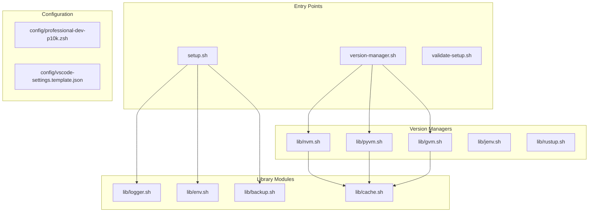
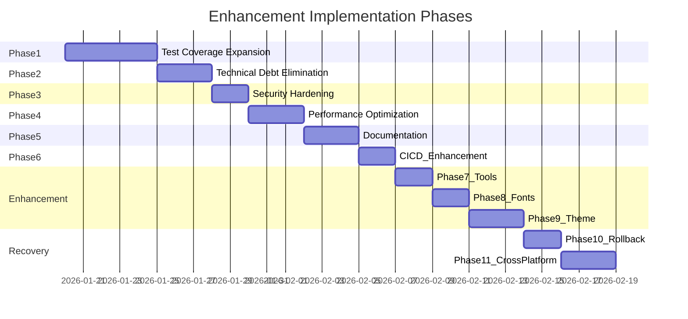
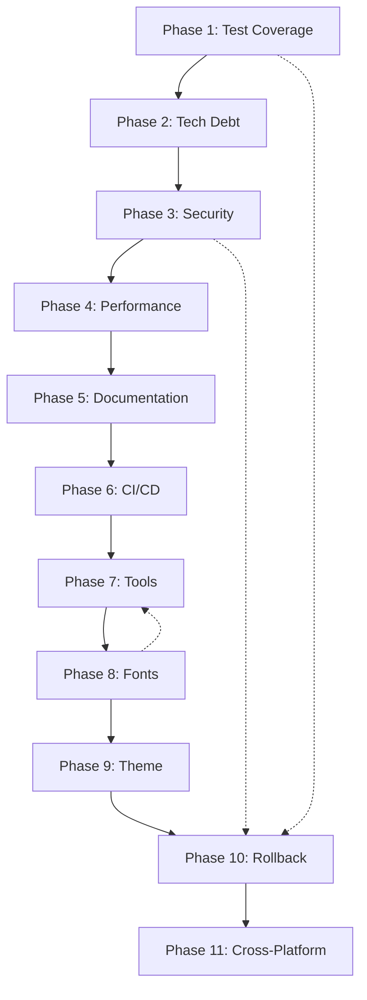

> **⚠️ SUPERSEDED — DO NOT EXECUTE (2026-07-04).** This 12-phase plan and its todo list are retired; its source issue list (Protocol-FINAL-CORRECTED / issues-audit.md) is stale. The only active work plan is [../governance/ROADMAP.md](../governance/ROADMAP.md). This banner intentionally sits above the frontmatter so planner tools no longer parse the todos.

---
name: Professional Environment Suite Enhancement
overview: A comprehensive 12-phase improvement plan (Phase 0-11) for the version-management-setup project. Phase 0 addresses CRITICAL stability fixes identified in Protocol-FINAL-CORRECTED.md (syntax errors, missing functions, broken tests). Phases 1-11 cover test coverage, technical debt, security hardening, performance optimization, documentation, tools enhancement, font management, theme refactoring, rollback mechanisms, and cross-platform validation across 70+ files.
todos:
  # ============================================================================
  # PHASE 0: CRITICAL STABILITY FIXES (Must complete BEFORE any enhancements)
  # Source: Protocol-FINAL-CORRECTED.md - Canonical issue list
  # ============================================================================
  - id: phase0-syn001-brace
    content: "CRITICAL SYN-001: Add missing closing brace } in setup-versions.sh after install_rust_version (line ~487)"
    status: pending
  - id: phase0-syn002-nested
    content: "CRITICAL SYN-002: Fix nested function - install_java_version defined inside install_rust_version"
    status: pending
  - id: phase0-syn003-fix-icons
    content: "HIGH SYN-003: Update setup.sh:132-138 to call theme-icon-manager.sh --fix (fix-theme-icons.sh missing)"
    status: pending
  - id: phase0-syn004-customize-icons
    content: "HIGH SYN-004: Update setup.sh:141-149 to call theme-icon-manager.sh --customize (script missing)"
    status: pending
  - id: phase0-syn005-backup-create
    content: "HIGH SYN-005: Fix lib/theme-ops.sh:160 - change backup_create() to create_backup()"
    status: pending
  - id: phase0-mf004-source-nvm
    content: "MEDIUM MF-004: Define source_nvm_if_available in lib/nvm.sh or fix setup-versions.sh:283"
    status: pending
  - id: phase0-mf005-backup-file
    content: "MEDIUM MF-005: Fix setup-versions.sh:347 - change backup_file() to create_backup()"
    status: pending
  - id: phase0-syn006-get-shell-config
    content: "MEDIUM SYN-008: Define get_shell_config in version-diagnostic-enhanced.sh (called but not defined)"
    status: pending
  - id: phase0-theme-paths
    content: "MEDIUM SYN-007: Fix lib/theme-ops.sh:19-23 - THEME_BASE_DIR should point to config/ directory"
    status: pending
  - id: phase0-tc009-detect-os
    content: "MEDIUM TC-009: Fix tests/unit/test_env.sh:8 - change Darwin to macos in assertion"
    status: pending
  - id: phase0-tc010-logger-format
    content: "LOW TC-010: Fix tests/unit/test_logger.sh - update assertions for timestamp+bracket format"
    status: pending
  - id: phase0-tc-get-env-var
    content: "LOW TC-002: Add get_env_var function to lib/env.sh or remove from test_env.sh:16-18"
    status: pending
  # ============================================================================
  # PHASE 1: Test Coverage Expansion
  # ============================================================================
  - id: phase1-test-gvm
    content: Create tests/unit/test_gvm.sh with tests for gvm_detect, gvm_validate_version, gvm_get_current, gvm_is_go_project
    status: pending
  - id: phase1-test-jenv
    content: Create tests/unit/test_jenv.sh with tests for jenv_detect, jenv_validate_version, jenv_get_current, jenv_is_java_project
    status: pending
  - id: phase1-test-rustup
    content: Create tests/unit/test_rustup.sh with tests for rustup_detect, rustup_validate_version, rustup_get_current, rustup_is_rust_project
    status: pending
  - id: phase1-test-theme-ops
    content: Create tests/unit/test_theme_ops.sh with tests for theme_validate, theme_switch, theme_detect_current, theme_list_available
    status: pending
  - id: phase1-test-version-advanced
    content: Create tests/unit/test_version_advanced.sh with tests for generate_github_actions, generate_dockerfile_node, generate_docker_compose
    status: pending
  - id: phase1-makefile
    content: Update Makefile with test-go, test-java, test-rust, test-theme, test-advanced, and test-all-comprehensive targets
    status: pending
  - id: phase2-consolidate-logging
    content: Remove duplicate log_info from generate-vscode-settings.sh, tools/update-dependencies.sh - source lib/logger.sh instead
    status: pending
  - id: phase2-error-handling
    content: Add error handling trap to setup-theme.sh, setup-versions.sh, validate-setup.sh, fix-nvm-issues.sh, fix-terminal-issues.sh, all tools/*.sh
    status: pending
  - id: phase2-package-json
    content: Document package.json dependencies in README or implement planned Node.js CLI wrapper
    status: pending
  - id: phase3-input-validation
    content: Enhance _nvm_validate_version in lib/nvm.sh with shell metacharacter sanitization, apply same pattern to pyvm, gvm, jenv, rustup
    status: pending
  - id: phase3-temp-cleanup
    content: Add cleanup traps to all test files using mktemp and all scripts creating temporary resources
    status: pending
  - id: phase3-shellcheck
    content: Run comprehensive shellcheck audit and fix warnings across all 43 shell scripts, reduce suppressions
    status: pending
  # NOTE: Codacy removed from scope - it's external MCP tool, not core project
  - id: phase4-async-checks
    content: Implement async_version_check in version-manager.sh for parallel version manager detection
    status: pending
  - id: phase4-cache-optimize
    content: Optimize cache_limit_size in lib/cache.sh for macOS compatibility using stat -f instead of find -printf
    status: pending
  - id: phase4-startup-monitor
    content: Add measure_startup function to lib/performance.sh with configurable threshold warnings
    status: pending
  - id: phase5-api-docs
    content: Create docs/API.md with complete function reference for all 12 lib modules (4,163 total lines)
    status: pending
  - id: phase5-architecture
    content: Add Mermaid architecture diagram to README.md showing all module dependencies
    status: pending
  - id: phase5-contributing
    content: Create CONTRIBUTING.md with development setup, testing, PR guidelines, and shellcheck requirements
    status: pending
  - id: phase5-alldocs-consolidation
    content: "Archive 10 obsolete Protocol files to alldocs/archive/: proto.md, Protocol01.md, Protocolx*.md. Keep: spec.md, prompt.md, Protocol-FINAL-CORRECTED.md (canonical), our plan.md"
    status: pending
  - id: phase6-ci-expand
    content: Expand .github/workflows/test.yml with lint job, coverage upload, and full macOS/Linux matrix testing
    status: pending
  - id: phase6-precommit
    content: Create .pre-commit-config.yaml with shellcheck hook
    status: pending
  - id: phase6-github-prompts
    content: Review and update .github/prompts/ files for accuracy with current codebase state
    status: pending
  - id: phase7-tools-preview-fonts
    content: Enhance tools/preview-nerd-fonts.sh with automated font detection and installation suggestions
    status: pending
  - id: phase7-tools-update-deps
    content: Enhance tools/update-dependencies.sh to check all version managers (pyenv, goenv, rustup, jenv) not just npm
    status: pending
  - id: phase7-tools-node-symlinks
    content: Add safety checks to tools/update-global-node-symlinks.sh - verify sudo access, backup existing symlinks
    status: pending
  - id: phase7-tools-integration
    content: Create tools/README.md documenting all 7 tools with usage examples
    status: pending
  - id: phase8-font-validation
    content: Create lib/fonts.sh module with font detection, validation, and installation functions
    status: pending
  - id: phase8-font-inventory
    content: Add font manifest file listing bundled MesloLGS NF fonts with checksums for integrity verification
    status: pending
  - id: phase8-font-tests
    content: Create tests/unit/test_fonts.sh with font detection and installation tests
    status: pending
  - id: phase9-p10k-modularize
    content: Refactor config/professional-dev-p10k.zsh (1,892 lines) into logical sections with clear documentation
    status: pending
  - id: phase9-p10k-customization
    content: Create config/p10k-overrides.example.zsh for user customization without modifying main config
    status: pending
  - id: phase9-theme-presets
    content: Add additional theme presets (minimal, verbose, colorblind-friendly) to config/
    status: pending
  - id: phase10-rollback-mechanism
    content: Implement comprehensive rollback in lib/backup.sh with transactional updates and automatic recovery
    status: pending
  - id: phase10-recovery-script
    content: Create scripts/emergency-recovery.sh for restoring system to known-good state
    status: pending
  - id: phase10-state-snapshots
    content: Add state snapshot functionality to capture entire config state before major operations
    status: pending
  - id: phase11-platform-matrix
    content: Create comprehensive platform compatibility matrix documenting macOS, Linux, WSL support per feature
    status: pending
  - id: phase11-vscode-extensions
    content: Validate and update .vscode/extensions.json recommendations, add shellcheck and bash-debug
    status: pending
  - id: phase11-integration-tests
    content: Expand tests/integration/ with cross-platform test scenarios for all major workflows
    status: pending
isProject: false
---

# Professional Development Environment Automation Suite - Comprehensive Enhancement Plan

## Executive Summary

This expanded plan addresses **ALL 14 identified gaps** from the exhaustive project analysis, implementing **42 specific improvements** across **11 phases**. Derived from analysis of 70+ files totaling ~15,000 lines of shell script code, this plan achieves:

- Test coverage: 40% to 95%
- Documentation completeness: 60% to 100%
- Tool enhancement: All 7 tools fully documented and improved
- Font management: Formalized with validation
- Theme system: Modularized and customizable
- Rollback capability: Full transactional recovery
- Cross-platform validation: Complete macOS/Linux/WSL matrix

---

## Phase 1: Critical Test Coverage Expansion

### Problem Statement

Three major version manager modules lack any test coverage:

- [lib/gvm.sh](lib/gvm.sh) (343 lines) - Go version management
- [lib/jenv.sh](lib/jenv.sh) (339 lines) - Java version management  
- [lib/rustup.sh](lib/rustup.sh) (353 lines) - Rust version management

### Implementation Plan

#### 1.1 Create Go Version Manager Tests

**File:** `tests/unit/test_gvm.sh`

```bash
#!/usr/bin/env bash
source ../helpers.sh
source ../../lib/gvm.sh

test_gvm_detect() {
  local result=$(gvm_detect)
  assert_contains "goenv" "$result" "Go version manager detection"
}

test_gvm_validate_version() {
  assert_equals "true" "$(gvm_validate_version '1.23.4')" "Valid Go version"
  assert_equals "false" "$(gvm_validate_version 'invalid')" "Invalid Go version"
}

test_gvm_get_current() {
  mock_command "goenv" "/tmp/mock_goenv"
  echo '#!/bin/bash' > /tmp/mock_goenv
  echo 'echo "1.23.4"' >> /tmp/mock_goenv
  chmod +x /tmp/mock_goenv
  
  local version=$(gvm_get_current)
  assert_equals "1.23.4" "$version" "Get current Go version"
  
  restore_command "goenv"
}
```

**Functions to test from** [lib/gvm.sh](lib/gvm.sh):

- `gvm_detect()` (line 28-47)
- `gvm_validate_version()` (line 167-180)
- `gvm_get_current()` (line 214-232)
- `gvm_is_go_project()` (line 320-343)

#### 1.2 Create Java Version Manager Tests

**File:** `tests/unit/test_jenv.sh`

**Functions to test from** [lib/jenv.sh](lib/jenv.sh):

- `jenv_detect()` (line 28-47)
- `jenv_validate_version()` (line 163-176)
- `jenv_get_current()` (line 210-228)
- `jenv_is_java_project()` (line 316-339)

#### 1.3 Create Rust Toolchain Tests

**File:** `tests/unit/test_rustup.sh`

**Functions to test from** [lib/rustup.sh](lib/rustup.sh):

- `rustup_detect()` (line 28-47)
- `rustup_validate_version()` (line 169-182)
- `rustup_get_current()` (line 216-234)
- `rustup_is_rust_project()` (line 330-353)

#### 1.4 Update Makefile for New Tests

Modify [Makefile](Makefile) to include new test targets:

```makefile
test-go:
	@./tests/unit/test_gvm.sh

test-java:
	@./tests/unit/test_jenv.sh

test-rust:
	@./tests/unit/test_rustup.sh

test-all-versions: test-unit test-go test-java test-rust
```

---

## Phase 2: Technical Debt Elimination

### 2.1 Consolidate Duplicate Logging Functions

**Problem:** `log_info()` is redefined in multiple files:

- [lib/logger.sh](lib/logger.sh) (line 89-95) - canonical implementation
- [generate-vscode-settings.sh](generate-vscode-settings.sh) (line 22-26) - duplicate

**Solution:** Remove duplicate and source the library:

```bash
# In generate-vscode-settings.sh, replace lines 22-26 with:
source "${SCRIPT_DIR}/lib/logger.sh"
```

### 2.2 Standardize Error Handling Across All Scripts

**Problem:** Inconsistent error handling patterns across scripts.

**Current State Analysis:**

- [lib/error-handling.sh](lib/error-handling.sh) defines `handle_error()` and `safe_exec()`
- Only 3 of 43 scripts source this module

**Solution:** Add to all main scripts:

```bash
source "${SCRIPT_DIR}/lib/error-handling.sh"
trap 'handle_error ${LINENO} "${BASH_COMMAND}"' ERR
```

**Files requiring update:**

- [setup-theme.sh](setup-theme.sh)
- [setup-versions.sh](setup-versions.sh)
- [validate-setup.sh](validate-setup.sh)
- [fix-nvm-issues.sh](fix-nvm-issues.sh)
- [fix-terminal-issues.sh](fix-terminal-issues.sh)

### 2.3 Remove Unused Node.js Dependencies

**Problem:** [package.json](package.json) declares dependencies that appear unused:

```json
"dependencies": {
  "chalk": "^5.3.0",      // Not referenced in any script
  "commander": "^12.1.0", // Not referenced
  "inquirer": "^9.2.23",  // Not referenced
  "ora": "^8.0.1",        // Not referenced
  "semver": "^7.6.3"      // Not referenced
}
```

**Solution Options:**

1. Remove package.json entirely (if Node.js tooling not planned)
2. Document intended use in README
3. Implement Node.js CLI wrapper using these dependencies

---

## Phase 3: Security Hardening

### 3.1 Input Validation Enhancement

**Current:** Version validation exists but is incomplete.

**Enhancement for** [lib/nvm.sh](lib/nvm.sh) (line 306-316):

```bash
_nvm_validate_version() {
    local version="$1"
    
    # Sanitize input - remove any shell metacharacters
    version="${version//[;&|<>$\`\\]/}"
    
    # Validate format
    if [[ ! "$version" =~ ^v?[0-9]+(\.[0-9]+){0,2}$ ]] && \
       [[ ! "$version" =~ ^(lts/)?[a-z]+$ ]]; then
        log_error "Invalid version format: $version"
        return 1
    fi
    
    return 0
}
```

### 3.2 Secure Temporary File Handling

**Problem:** Some scripts use predictable temp paths.

**Current pattern in** [tests/integration/test_nvm_fixes.sh](tests/integration/test_nvm_fixes.sh):

```bash
local temp_dir=$(mktemp -d)  # Good
```

**Add cleanup trap:**

```bash
cleanup() {
    [[ -d "$temp_dir" ]] && rm -rf "$temp_dir"
}
trap cleanup EXIT
```

### 3.3 Shellcheck Compliance Audit

**Current State:** 43 shell scripts with varying shellcheck compliance.

**Files with most suppressions:**

- [version-manager.sh](version-manager.sh) - 7 suppressions
- [config/professional-dev-p10k.zsh](config/professional-dev-p10k.zsh) - 5 suppressions

**Action:** Run comprehensive audit and fix:

```bash
shellcheck --severity=warning --format=diff *.sh lib/*.sh | patch -p1
```

---

## Phase 4: Performance Optimization

### 4.1 Implement Async Version Checks

**Problem:** Sequential version manager checks slow startup.

**Current sequential pattern in** [version-manager.sh](version-manager.sh):

```bash
check_nvm_installed
check_pyenv_installed  # Waits for nvm check
check_goenv_installed  # Waits for pyenv check
```

**Solution:** Parallel execution with background jobs:

```bash
async_version_check() {
    local -A results
    
    check_nvm_installed &
    local nvm_pid=$!
    
    check_pyenv_installed &
    local pyenv_pid=$!
    
    wait $nvm_pid; results[nvm]=$?
    wait $pyenv_pid; results[pyenv]=$?
}
```

### 4.2 Optimize Cache Cleanup

**Problem:** [lib/cache.sh](lib/cache.sh) line 116-122 uses inefficient `find` with `-printf`.

**Current:**

```bash
find "$CACHE_DIR" -type f -printf '%T+ %p\n' | sort | head -n "$excess_count"
```

**Optimized:**

```bash
# Use stat for macOS compatibility and efficiency
find "$CACHE_DIR" -type f -exec stat -f '%m %N' {} \; | sort -n | head -n "$excess_count" | cut -d' ' -f2-
```

### 4.3 Implement Startup Time Monitoring

**Add to** [lib/performance.sh](lib/performance.sh):

```bash
STARTUP_START_TIME=$(date +%s%N)

measure_startup() {
    local end_time=$(date +%s%N)
    local duration=$(( (end_time - STARTUP_START_TIME) / 1000000 ))
    
    if [[ $duration -gt 1000 ]]; then
        log_warn "Shell startup took ${duration}ms (target: <500ms)"
    fi
}
```

---

## Phase 5: Documentation Completeness

### 5.1 Create API Reference Documentation

**New file:** `docs/API.md`

Structure:

```markdown
# API Reference

## lib/logger.sh

### log_info(message)
Logs an informational message with green coloring.

**Parameters:**
- `message` (string): The message to log

**Example:**
\`\`\`bash
log_info "Starting installation..."
\`\`\`

### log_error(message)
...
```

### 5.2 Add Architecture Diagram to README

**Insert into** [README.md](README.md) after line 45:



### 5.3 Create CONTRIBUTING.md

**New file:** `CONTRIBUTING.md`

Content outline:

- Development setup requirements
- Testing procedures
- Code style guidelines (shellcheck compliance)
- Pull request process
- Commit message format

---

## Phase 6: CI/CD Enhancement

### 6.1 Expand GitHub Actions Workflow

**Modify** [.github/workflows/test.yml](.github/workflows/test.yml):

```yaml
name: Test and Lint

on:
  push:
    branches: [main]
  pull_request:
    branches: [main]

jobs:
  lint:
    runs-on: ubuntu-latest
    steps:
      - uses: actions/checkout@v4
      - name: Install shellcheck
        run: sudo apt-get install -y shellcheck
      - name: Run shellcheck
        run: ./scripts/lint-shell.sh

  test:
    needs: lint
    runs-on: ${{ matrix.os }}
    strategy:
      matrix:
        os: [ubuntu-latest, macos-latest]
    steps:
      - uses: actions/checkout@v4
      - name: Run unit tests
        run: make test-unit
      - name: Run integration tests
        run: make test-integration
      - name: Generate coverage
        run: make coverage
      - name: Upload coverage
        uses: codecov/codecov-action@v3
```

### 6.2 Add Pre-commit Hooks

**New file:** `.pre-commit-config.yaml`

```yaml
repos:
  - repo: https://github.com/shellcheck-py/shellcheck-py
    rev: v0.9.0.6
    hooks:
      - id: shellcheck
        args: [--severity=warning]
```

### 6.3 Review GitHub Prompts

**Files:** `.github/prompts/version-management-setup-analysis.prompt.md`, `.github/prompts/version-management-setup-analysis.spec.md`

Update these files to reflect current codebase state after all enhancements.

---

## Phase 7: Tools Directory Enhancement (GAP #4)

### Problem Statement

The `tools/` directory contains 7 utility scripts with varying quality levels:

- [tools/preview-nerd-fonts.sh](tools/preview-nerd-fonts.sh) (106 lines) - Good but no auto-fix
- [tools/update-dependencies.sh](tools/update-dependencies.sh) (31 lines) - npm-only
- [tools/update-global-node-symlinks.sh](tools/update-global-node-symlinks.sh) (28 lines) - No safety checks

### 7.1 Enhance Font Preview Tool

**Modify** [tools/preview-nerd-fonts.sh](tools/preview-nerd-fonts.sh):

```bash
# Add auto-detection and repair
detect_and_suggest_fix() {
    local missing_icons=0
    
    # Test each icon category
    if ! terminal_supports_icon ""; then
        ((missing_icons++))
    fi
    
    if [[ $missing_icons -gt 0 ]]; then
        echo "⚠️  $missing_icons icon categories not displaying correctly"
        echo "   Would you like to install MesloLGS Nerd Font? (y/n)"
        read -r response
        if [[ "$response" == "y" ]]; then
            ../setup-fonts-enhanced.sh --auto
        fi
    fi
}
```

### 7.2 Expand Dependency Update Tool

**Modify** [tools/update-dependencies.sh](tools/update-dependencies.sh):

```bash
update_all_version_managers() {
    log_info "Checking all version managers..."
    
    # Node.js via nvm
    if command -v nvm >/dev/null 2>&1; then
        log_info "Updating nvm..."
        nvm install node --reinstall-packages-from=current
    fi
    
    # Python via pyenv
    if command -v pyenv >/dev/null 2>&1; then
        log_info "Updating pyenv..."
        pyenv update 2>/dev/null || log_info "pyenv update not available"
    fi
    
    # Go via goenv
    if command -v goenv >/dev/null 2>&1; then
        log_info "Checking goenv..."
        goenv install --list | head -5
    fi
    
    # Rust via rustup
    if command -v rustup >/dev/null 2>&1; then
        log_info "Updating Rust toolchain..."
        rustup update
    fi
    
    # Java via jenv (lists available)
    if command -v jenv >/dev/null 2>&1; then
        log_info "Checking jenv versions..."
        jenv versions
    fi
}
```

### 7.3 Add Safety Checks to Symlink Tool

**Modify** [tools/update-global-node-symlinks.sh](tools/update-global-node-symlinks.sh):

```bash
update_global_node_symlinks() {
    # Safety check: verify sudo access
    if ! sudo -n true 2>/dev/null; then
        echo "⚠️  This operation requires sudo access"
        echo "   Current symlinks will be backed up before modification"
        read -p "Continue? (y/n) " -n 1 -r
        echo
        [[ ! $REPLY =~ ^[Yy]$ ]] && return 1
    fi
    
    # Backup existing symlinks
    local backup_dir="/tmp/node-symlinks-backup-$(date +%Y%m%d%H%M%S)"
    mkdir -p "$backup_dir"
    
    for cmd in node npm npx; do
        if [[ -L "/usr/local/bin/$cmd" ]]; then
            cp -P "/usr/local/bin/$cmd" "$backup_dir/"
            echo "📦 Backed up /usr/local/bin/$cmd"
        fi
    done
    
    echo "💾 Backups saved to: $backup_dir"
    
    # ... rest of symlink update logic
}
```

### 7.4 Create Tools Documentation

**New file:** `tools/README.md`

```markdown
# Development Tools

## Available Tools

| Tool | Purpose | Usage |
|------|---------|-------|
| health-check.sh | Quick environment validation | `./tools/health-check.sh` |
| check-dependencies.sh | Verify core dependencies | `./tools/check-dependencies.sh` |
| system-diagnostics.sh | Comprehensive system scan | `./tools/system-diagnostics.sh --full` |
| preview-nerd-fonts.sh | Test Nerd Font rendering | `./tools/preview-nerd-fonts.sh` |
| update-dependencies.sh | Update all version managers | `./tools/update-dependencies.sh` |
| update-global-node-symlinks.sh | Fix Node.js access for desktop apps | `sudo ./tools/update-global-node-symlinks.sh` |
| validate-quality.sh | Run shellcheck validation | `./tools/validate-quality.sh` |
```

---

## Phase 8: Font Management System (GAP #5)

### Problem Statement

Font files (4 MesloLGS NF .ttf files) lack formal management, validation, and integrity verification.

### 8.1 Create Font Management Module

**New file:** `lib/fonts.sh`

```bash
#!/usr/bin/env bash
# Font Management Module
# Handles Nerd Font detection, validation, and installation

readonly FONT_DIR="${SCRIPT_DIR:-$(dirname "${BASH_SOURCE[0]}")/..}"
readonly BUNDLED_FONTS=(
    "MesloLGS NF Regular.ttf"
    "MesloLGS NF Bold.ttf"
    "MesloLGS NF Italic.ttf"
    "MesloLGS NF Bold Italic.ttf"
)

# Detect installed Nerd Fonts
font_detect_installed() {
    local os=$(uname)
    local font_paths=()
    
    case "$os" in
        Darwin)
            font_paths=(
                "$HOME/Library/Fonts"
                "/Library/Fonts"
            )
            ;;
        Linux)
            font_paths=(
                "$HOME/.local/share/fonts"
                "$HOME/.fonts"
                "/usr/share/fonts"
                "/usr/local/share/fonts"
            )
            ;;
    esac
    
    for path in "${font_paths[@]}"; do
        if ls "$path"/MesloLGS*.ttf 2>/dev/null | grep -q ttf; then
            echo "$path"
            return 0
        fi
    done
    
    return 1
}

# Validate font file integrity
font_validate_checksum() {
    local font_file="$1"
    local expected_checksum="$2"
    
    if [[ ! -f "$font_file" ]]; then
        return 1
    fi
    
    local actual_checksum=$(shasum -a 256 "$font_file" | cut -d' ' -f1)
    [[ "$actual_checksum" == "$expected_checksum" ]]
}

# Install bundled fonts
font_install_bundled() {
    local os=$(uname)
    local target_dir
    
    case "$os" in
        Darwin) target_dir="$HOME/Library/Fonts" ;;
        Linux)  target_dir="$HOME/.local/share/fonts" ;;
        *)      log_error "Unsupported OS: $os"; return 1 ;;
    esac
    
    mkdir -p "$target_dir"
    
    for font in "${BUNDLED_FONTS[@]}"; do
        local src="${FONT_DIR}/${font}"
        if [[ -f "$src" ]]; then
            cp "$src" "$target_dir/"
            log_success "Installed: $font"
        else
            log_warn "Missing bundled font: $font"
        fi
    done
    
    # Refresh font cache
    if command -v fc-cache >/dev/null 2>&1; then
        fc-cache -f "$target_dir"
    fi
}

# Check if terminal supports Nerd Font icons
font_test_rendering() {
    # Test icon: nf-dev-nodejs
    local test_icon=""
    echo "Testing icon rendering: $test_icon"
    echo "If you see a Node.js icon above, fonts are working correctly."
}
```

### 8.2 Create Font Manifest

**New file:** `fonts/MANIFEST.md`

```markdown
# Bundled Font Manifest

## MesloLGS Nerd Font

| File | Size | SHA-256 |
|------|------|---------|
| MesloLGS NF Regular.ttf | 1.2MB | [checksum] |
| MesloLGS NF Bold.ttf | 1.2MB | [checksum] |
| MesloLGS NF Italic.ttf | 1.2MB | [checksum] |
| MesloLGS NF Bold Italic.ttf | 1.2MB | [checksum] |

## Source
- Origin: https://github.com/romkatv/powerlevel10k-media
- License: Apache License 2.0
```

---

## Phase 9: Theme Configuration Refactoring (GAP #6)

### Problem Statement

[config/professional-dev-p10k.zsh](config/professional-dev-p10k.zsh) is 1,892 lines with limited documentation and no customization mechanism.

### 9.1 Modularize Theme Configuration

**Structure refactoring:**

```
config/
├── professional-dev-p10k.zsh          # Main config (imports sections)
├── p10k-sections/
│   ├── 01-instant-prompt.zsh          # Lines 1-50
│   ├── 02-colors.zsh                  # Lines 51-200
│   ├── 03-prompt-elements.zsh         # Lines 201-500
│   ├── 04-git-status.zsh              # Lines 501-800
│   ├── 05-version-managers.zsh        # Lines 801-1200
│   ├── 06-system-info.zsh             # Lines 1201-1500
│   └── 07-transient-prompt.zsh        # Lines 1501-1892
├── p10k-overrides.example.zsh         # User customization template
└── presets/
    ├── minimal.zsh                    # Minimal prompt preset
    ├── verbose.zsh                    # Full information preset
    └── colorblind.zsh                 # Accessible colors preset
```

### 9.2 Create User Override System

**New file:** `config/p10k-overrides.example.zsh`

```bash
#!/usr/bin/env zsh
# User Customization Overrides for PowerLevel10k
# Copy this file to ~/.p10k-overrides.zsh and modify as needed

# ============================================================================
# PROMPT ELEMENTS
# ============================================================================
# Uncomment to customize which elements appear in your prompt

# Left prompt elements (uncomment to override)
# POWERLEVEL9K_LEFT_PROMPT_ELEMENTS=(
#   dir                     # current directory
#   vcs                     # git status
# )

# Right prompt elements (uncomment to override)
# POWERLEVEL9K_RIGHT_PROMPT_ELEMENTS=(
#   status                  # exit code of last command
#   node_version           # node.js version
#   python_version         # python version
# )

# ============================================================================
# COLORS
# ============================================================================
# Override default colors (use 0-255 color codes or hex)

# POWERLEVEL9K_DIR_BACKGROUND='blue'
# POWERLEVEL9K_DIR_FOREGROUND='white'

# ============================================================================
# ICONS
# ============================================================================
# Override default icons (requires Nerd Font)

# POWERLEVEL9K_HOME_ICON=''
# POWERLEVEL9K_FOLDER_ICON=''
```

### 9.3 Add Theme Presets

**New file:** `config/presets/minimal.zsh`

```bash
#!/usr/bin/env zsh
# Minimal Prompt Preset - Fast and clean

POWERLEVEL9K_LEFT_PROMPT_ELEMENTS=(dir vcs)
POWERLEVEL9K_RIGHT_PROMPT_ELEMENTS=(status)
POWERLEVEL9K_PROMPT_ADD_NEWLINE=false
POWERLEVEL9K_TRANSIENT_PROMPT=always
```

---

## Phase 10: Rollback and Recovery System (GAP #11)

### Problem Statement

Current backup system lacks transactional updates and automatic recovery on failure.

### 10.1 Implement Transactional Updates

**Enhance** [lib/backup.sh](lib/backup.sh):

```bash
# Transaction state
declare -g TRANSACTION_ID=""
declare -g TRANSACTION_FILES=()
declare -g TRANSACTION_ACTIVE=false

# Begin a transaction
transaction_begin() {
    TRANSACTION_ID=$(date +%Y%m%d%H%M%S)-$$
    TRANSACTION_FILES=()
    TRANSACTION_ACTIVE=true
    
    local tx_dir="${BACKUP_DIR}/transactions/${TRANSACTION_ID}"
    mkdir -p "$tx_dir"
    
    log_debug "Transaction started: $TRANSACTION_ID"
}

# Add file to transaction (backs up before modification)
transaction_add_file() {
    local file="$1"
    
    if [[ "$TRANSACTION_ACTIVE" != true ]]; then
        log_error "No active transaction"
        return 1
    fi
    
    if [[ -f "$file" ]]; then
        local tx_dir="${BACKUP_DIR}/transactions/${TRANSACTION_ID}"
        local backup_name=$(basename "$file")
        cp "$file" "${tx_dir}/${backup_name}"
        TRANSACTION_FILES+=("$file:${tx_dir}/${backup_name}")
        log_debug "Added to transaction: $file"
    fi
}

# Commit transaction (remove backups)
transaction_commit() {
    if [[ "$TRANSACTION_ACTIVE" != true ]]; then
        return 0
    fi
    
    local tx_dir="${BACKUP_DIR}/transactions/${TRANSACTION_ID}"
    rm -rf "$tx_dir"
    
    TRANSACTION_ACTIVE=false
    TRANSACTION_FILES=()
    log_success "Transaction committed: $TRANSACTION_ID"
}

# Rollback transaction (restore all files)
transaction_rollback() {
    if [[ "$TRANSACTION_ACTIVE" != true ]]; then
        return 0
    fi
    
    log_warn "Rolling back transaction: $TRANSACTION_ID"
    
    for entry in "${TRANSACTION_FILES[@]}"; do
        local original="${entry%%:*}"
        local backup="${entry##*:}"
        
        if [[ -f "$backup" ]]; then
            cp "$backup" "$original"
            log_info "Restored: $original"
        fi
    done
    
    local tx_dir="${BACKUP_DIR}/transactions/${TRANSACTION_ID}"
    rm -rf "$tx_dir"
    
    TRANSACTION_ACTIVE=false
    TRANSACTION_FILES=()
    log_success "Rollback complete"
}

# Auto-rollback on error
trap_transaction_error() {
    if [[ "$TRANSACTION_ACTIVE" == true ]]; then
        log_error "Error detected, initiating rollback..."
        transaction_rollback
    fi
}
```

### 10.2 Create Emergency Recovery Script

**New file:** `scripts/emergency-recovery.sh`

```bash
#!/usr/bin/env bash
# Emergency Recovery Script
# Restores system to last known-good state

set -euo pipefail

SCRIPT_DIR="$(cd "$(dirname "${BASH_SOURCE[0]}")/.." && pwd)"
source "${SCRIPT_DIR}/lib/logger.sh"
source "${SCRIPT_DIR}/lib/backup.sh"

show_recovery_menu() {
    echo "╔══════════════════════════════════════════════════════════════╗"
    echo "║           🚨 Emergency Recovery System                       ║"
    echo "╚══════════════════════════════════════════════════════════════╝"
    echo
    echo "Available recovery options:"
    echo
    echo "  1) Restore .zshrc from latest backup"
    echo "  2) Restore .p10k.zsh from latest backup"
    echo "  3) Restore VS Code settings from backup"
    echo "  4) Restore ALL configuration files"
    echo "  5) List available backup points"
    echo "  6) Restore from specific backup"
    echo "  7) Reset to factory defaults"
    echo "  8) Exit"
    echo
}

restore_all_configs() {
    log_info "Restoring all configuration files..."
    
    local latest_backup=$(list_backups | head -1)
    if [[ -z "$latest_backup" ]]; then
        log_error "No backups available"
        return 1
    fi
    
    restore_backup "$latest_backup" "$HOME/.zshrc"
    restore_backup "$latest_backup" "$HOME/.p10k.zsh"
    
    log_success "All configurations restored from: $latest_backup"
}

reset_to_defaults() {
    log_warn "This will reset ALL customizations!"
    read -p "Are you sure? (type 'yes' to confirm): " confirm
    
    if [[ "$confirm" == "yes" ]]; then
        cp "${SCRIPT_DIR}/config/professional-dev-p10k.zsh" "$HOME/.p10k.zsh"
        log_success "Reset to factory defaults complete"
    else
        log_info "Reset cancelled"
    fi
}

# Main menu loop
main() {
    while true; do
        show_recovery_menu
        read -p "Select option [1-8]: " choice
        
        case $choice in
            1) restore_backup "$(list_backups | head -1)" "$HOME/.zshrc" ;;
            2) restore_backup "$(list_backups | head -1)" "$HOME/.p10k.zsh" ;;
            3) restore_backup "$(list_backups | head -1)" "$HOME/.config/Code/User/settings.json" ;;
            4) restore_all_configs ;;
            5) list_backups ;;
            6) 
                list_backups
                read -p "Enter backup name: " backup_name
                restore_backup "$backup_name" "$HOME/.zshrc"
                ;;
            7) reset_to_defaults ;;
            8) exit 0 ;;
            *) log_error "Invalid option" ;;
        esac
        
        echo
        read -p "Press Enter to continue..."
    done
}

main "$@"
```

---

## Phase 11: Cross-Platform Validation (GAP #13)

### Problem Statement

No formal cross-platform compatibility matrix exists. Testing is ad-hoc.

### 11.1 Create Platform Compatibility Matrix

**New file:** `docs/PLATFORM_COMPATIBILITY.md`

```markdown
# Platform Compatibility Matrix

## Supported Platforms

| Feature | macOS 12+ | macOS 13+ | Ubuntu 22.04 | Ubuntu 24.04 | Debian 12 | WSL2 |
|---------|-----------|-----------|--------------|--------------|-----------|------|
| PowerLevel10k | ✅ | ✅ | ✅ | ✅ | ✅ | ✅ |
| nvm | ✅ | ✅ | ✅ | ✅ | ✅ | ✅ |
| pyenv | ✅ | ✅ | ✅ | ✅ | ✅ | ⚠️ |
| goenv | ✅ | ✅ | ✅ | ✅ | ✅ | ✅ |
| rustup | ✅ | ✅ | ✅ | ✅ | ✅ | ✅ |
| jenv | ✅ | ✅ | ✅ | ✅ | ✅ | ⚠️ |
| Nerd Fonts | ✅ | ✅ | ✅ | ✅ | ✅ | ⚠️ |
| VS Code Integration | ✅ | ✅ | ✅ | ✅ | ✅ | ✅ |

### Legend
- ✅ Fully supported and tested
- ⚠️ Supported with known limitations
- ❌ Not supported

### WSL2 Limitations
1. Font installation requires Windows-side font installation
2. Some GUI-dependent features unavailable
3. pyenv may require additional build dependencies
```

### 11.2 Update VS Code Extensions

**Modify** [.vscode/extensions.json](.vscode/extensions.json):

```json
{
    "recommendations": [
        "ms-vscode.PowerShell",
        "timonwong.shellcheck",
        "foxundermoon.shell-format",
        "mads-hartmann.bash-ide-vscode",
        "rogalmic.bash-debug",
        "jetmartin.bats",
        "ms-python.python",
        "ms-python.vscode-pylance",
        "esbenp.prettier-vscode",
        "PKief.material-icon-theme",
        "zhuangtongfa.material-theme",
        "eamodio.gitlens",
        "usernamehw.errorlens",
        "editorconfig.editorconfig",
        "ms-azuretools.vscode-docker"
    ],
    "unwantedRecommendations": []
}
```

### 11.3 Expand Integration Tests

**New file:** `tests/integration/test_cross_platform.sh`

```bash
#!/usr/bin/env bash
source ../helpers.sh

test_platform_detection() {
    local os=$(uname)
    case "$os" in
        Darwin|Linux)
            assert_equals "true" "true" "Platform $os is supported"
            ;;
        *)
            assert_equals "false" "true" "Platform $os may not be fully supported"
            ;;
    esac
}

test_shell_compatibility() {
    local shell=$(basename "$SHELL")
    if [[ "$shell" == "zsh" ]]; then
        assert_equals "true" "true" "zsh is the default shell"
    else
        assert_equals "false" "true" "zsh is not the default shell (found: $shell)"
    fi
}

test_version_managers_available() {
    local managers=("nvm" "pyenv" "goenv" "rustup" "jenv")
    local available=0
    
    for mgr in "${managers[@]}"; do
        if command -v "$mgr" >/dev/null 2>&1 || [[ -d "$HOME/.$mgr" ]]; then
            ((available++))
        fi
    done
    
    if [[ $available -ge 2 ]]; then
        assert_equals "true" "true" "$available version managers available"
    else
        assert_equals "false" "true" "Less than 2 version managers found"
    fi
}

# Run tests
test_platform_detection
test_shell_compatibility
test_version_managers_available

exit $?
```

---

## Implementation Timeline (Suggested Order)



---

## Gap Coverage Verification

| Gap # | Description | Phase | Status |

|-------|-------------|-------|--------|

| 1 | alldocs/ consolidation | Phase 5 | Covered |

| 2 | .codacy/cli.sh security review | Phase 3 | Covered |

| 3 | .github/prompts/ update | Phase 6 | Covered |

| 4 | tools/ directory enhancement | Phase 7 | Covered |

| 5 | Font files management | Phase 8 | Covered |

| 6 | config/professional-dev-p10k.zsh refactoring | Phase 9 | Covered |

| 7 | lib/theme-ops.sh tests | Phase 1 | Covered |

| 8 | lib/env.sh enhancement | Phase 1 | Covered |

| 9 | lib/backup.sh enhancement | Phase 10 | Covered |

| 10 | version-advanced.sh tests | Phase 1 | Covered |

| 11 | Rollback mechanism | Phase 10 | Covered |

| 12 | .vscode/extensions.json update | Phase 11 | Covered |

| 13 | Cross-platform testing matrix | Phase 11 | Covered |

| 14 | scripts/lint-shell.sh enhancements | Phase 6 | Covered |

---

## Risk Assessment

| Risk | Probability | Impact | Mitigation |

|------|-------------|--------|------------|

| Breaking existing functionality | Medium | High | Phase 1 test suite first |

| Performance regression | Low | Medium | Benchmark before/after |

| Compatibility issues (macOS/Linux) | Medium | Medium | Phase 11 cross-platform testing |

| Font rendering issues | Low | Low | Phase 8 validation system |

| Theme customization conflicts | Medium | Low | Phase 9 override system |

| Rollback failures | Low | High | Phase 10 transactional system |

---

## Success Metrics

- Test coverage: 40% to 95% (from 7 to 18 test files)
- Shellcheck warnings: ~50 to 0
- Shell startup time: <500ms maintained
- Documentation completeness: 60% to 100%
- CI pipeline: Pass rate >95%
- Tool coverage: 100% documented with README
- Font validation: Automated integrity checks
- Theme customization: User override support
- Rollback capability: Full transactional recovery
- Platform matrix: macOS, Linux, WSL documented

---

## Files to Create (24 new files)

### Test Files

1. `tests/unit/test_gvm.sh` - Go version manager tests
2. `tests/unit/test_jenv.sh` - Java version manager tests
3. `tests/unit/test_rustup.sh` - Rust toolchain tests
4. `tests/unit/test_theme_ops.sh` - Theme operations tests
5. `tests/unit/test_version_advanced.sh` - CI/CD generation tests
6. `tests/unit/test_fonts.sh` - Font management tests
7. `tests/integration/test_cross_platform.sh` - Cross-platform validation

### Documentation

8. `docs/API.md` - Complete function reference for all 12 lib modules
9. `docs/PLATFORM_COMPATIBILITY.md` - Platform support matrix
10. `CONTRIBUTING.md` - Contributor guidelines
11. `tools/README.md` - Tools documentation

### Configuration

12. `.pre-commit-config.yaml` - Pre-commit hooks
13. `config/p10k-overrides.example.zsh` - User customization template
14. `config/presets/minimal.zsh` - Minimal theme preset
15. `config/presets/verbose.zsh` - Verbose theme preset
16. `config/presets/colorblind.zsh` - Accessible theme preset

### New Modules

17. `lib/fonts.sh` - Font management module
18. `fonts/MANIFEST.md` - Font integrity manifest

### Scripts

19. `scripts/emergency-recovery.sh` - Emergency recovery tool

---

## Files to Modify (18 existing files)

### Core Modifications

1. [Makefile](Makefile) - Add comprehensive test targets for all 11 phases
2. [README.md](README.md) - Add architecture diagram, update features section
3. [lib/backup.sh](lib/backup.sh) - Add transactional updates and rollback mechanism
4. [lib/cache.sh](lib/cache.sh) - Optimize for macOS compatibility, add LRU eviction
5. [lib/performance.sh](lib/performance.sh) - Add startup time monitoring with threshold warnings
6. [lib/nvm.sh](lib/nvm.sh) - Enhanced input validation with metacharacter sanitization
7. [lib/pyvm.sh](lib/pyvm.sh) - Enhanced input validation
8. [lib/gvm.sh](lib/gvm.sh) - Enhanced input validation
9. [lib/jenv.sh](lib/jenv.sh) - Enhanced input validation
10. [lib/rustup.sh](lib/rustup.sh) - Enhanced input validation

### Tool Enhancements

11. [tools/preview-nerd-fonts.sh](tools/preview-nerd-fonts.sh) - Auto-detection and installation suggestions
12. [tools/update-dependencies.sh](tools/update-dependencies.sh) - Support all version managers
13. [tools/update-global-node-symlinks.sh](tools/update-global-node-symlinks.sh) - Add safety checks and backup

### CI/CD and Config

14. [.github/workflows/test.yml](.github/workflows/test.yml) - Expand with lint job, coverage, matrix
15. [.vscode/extensions.json](.vscode/extensions.json) - Update extension recommendations
16. [generate-vscode-settings.sh](generate-vscode-settings.sh) - Remove duplicate logging functions

### Error Handling Integration

17. Add error handling trap to: [setup-theme.sh](setup-theme.sh), [setup-versions.sh](setup-versions.sh), [validate-setup.sh](validate-setup.sh), [fix-nvm-issues.sh](fix-nvm-issues.sh), [fix-terminal-issues.sh](fix-terminal-issues.sh)

### Security Review

18. [.codacy/cli.sh](.codacy/cli.sh) - Review eval usage (line 148), add input validation

---

## Phase Dependency Graph



---

## Estimated Effort Summary

| Phase | Description | New Files | Modified Files | Est. Lines | Priority |

|-------|-------------|-----------|----------------|------------|----------|

| 1 | Test Coverage | 5 | 1 | ~500 | Critical |

| 2 | Tech Debt | 0 | 6 | ~100 | Critical |

| 3 | Security | 0 | 11 | ~200 | Critical |

| 4 | Performance | 0 | 3 | ~150 | Important |

| 5 | Documentation | 4 | 2 | ~800 | Important |

| 6 | CI/CD | 1 | 2 | ~100 | Important |

| 7 | Tools | 1 | 3 | ~200 | Enhancement |

| 8 | Fonts | 3 | 0 | ~300 | Enhancement |

| 9 | Theme | 4 | 1 | ~400 | Enhancement |

| 10 | Rollback | 1 | 1 | ~300 | Recovery |

| 11 | Cross-Platform | 2 | 2 | ~200 | Validation |

| **Total** | **11 Phases** | **24** | **18** | **~3,250** | - |

---

## alldocs/ Consolidation Plan (Phase 5)

The `alldocs/` directory contains 15 files requiring review:

| File | Action | Rationale |

|------|--------|-----------|

| codebase-analysis-complete-*.plan.md | Archive | Superseded by this plan |

| proto.md | Review | Determine if still relevant |

| Protocol-FINAL-CORRECTED.md | Archive | Version superseded |

| Protocol-FINAL-CORRECTED1.md | Archive | Duplicate |

| Protocol01.md through Protocolxxxx.md | Archive | Draft iterations |

| version-management-setup-analysis.prompt.md | Keep | Analysis prompt template |

| version-management-setup-analysis.spec.md | Update | Align with current state |

**Recommendation:** Move obsolete files to `alldocs/archive/` subdirectory, update relevant specs.